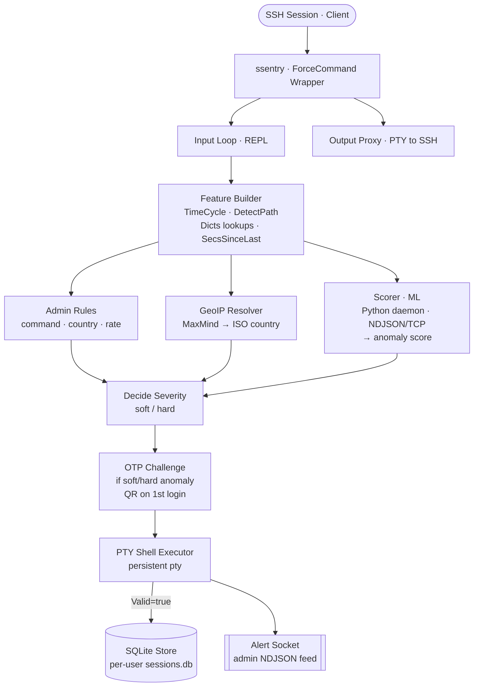
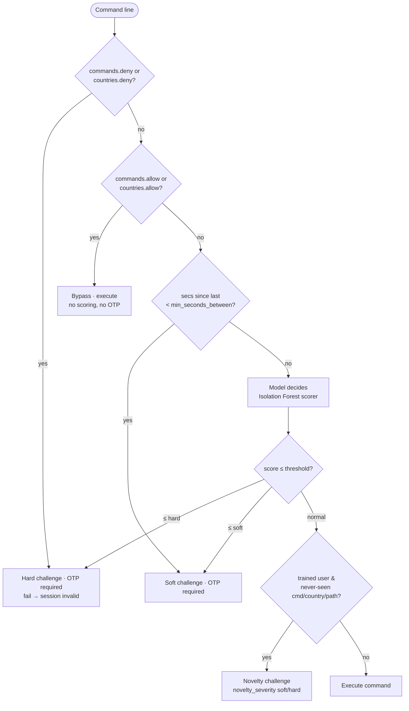

# Shell Sentry (`ssentry`)

[](https://go.dev/)
[](./LICENSE)
[](#contributing)
[](#build)

**A ForceCommand shell wrapper that scores every SSH command for anomalies and gates suspicious activity behind TOTP verification.**

## Overview

Shell Sentry (`ssentry`) is a security-first SSH shell wrapper that runs on the server side to detect and challenge anomalous commands in real time. It combines:

- **Per-command anomaly scoring** via a Python inference daemon (Isolation Forest model)
- **Frequency-encoded behavioural features** (command / country / path all weighted by how often the user does them — common = normal, rare = suspicious)
- **Novelty gate** (a command / country / path never seen for an already-trained user is challenged in the context of *that user's* history — "you never `sudo`, so this `sudo` is flagged")
- **Admin pre-filters** (command deny/allow lists, country deny/allow lists, rate limiting)
- **Adaptive challenges** (TOTP verification for soft/hard anomalies)
- **Persistent session logging** (per-user SQLite, one session per SSH login)
- **GeoIP resolution** (MaxMind GeoLite2; influences anomaly scoring)
- **Admin alerting** (Unix socket, real-time NDJSON alert stream)

## Architecture

Hexagonal: `core/` is pure Go (zero external deps), `ports/` defines contracts, `adapters/` implement them, `cmd/ssentry/` wires everything.



### Rule Precedence (decision flow)



Severity is the **max** of the model verdict and the novelty gate: a novel item
never *downgrades* a harder model/rule verdict, but it escalates a
model-says-normal command to a challenge.

## Quickstart

### Build

```bash
go build -o ssentry ./cmd/ssentry
```

### Configure

Copy and customize the config and rules:

```bash
cp config.example.yaml config.yaml
cp rules.example.json rules.json
mkdir -p data
```

Download `GeoLite2-Country.mmdb` from MaxMind (free account) into the project root, or update `geoip_db_path` in `config.yaml`.

### Start the Python Inference Daemon

The daemon scores every command; it must be running before `ssentry` launches.

```bash
make venv       # one-time: create python/venv, install deps
make daemon     # starts python/daemon.py --config config.yaml
```

It is a `ThreadingTCPServer` that reads the **same `config.yaml`** as the Go side
(`daemon_addr`, `root_path`, `model_ttl_sec`). Per user it loads
`<root_path>/<user>/model.pkl` on demand, caches it in memory, **reloads it
automatically when a retrain changes the file's mtime**, and evicts models idle
beyond `model_ttl_sec`. A user with no trained model yet gets a high (normal)
score, so nothing is challenged; a corrupt model or malformed request closes the
connection so the runtime fail-opens.

If the daemon runs on a **different host**, give it its own copy of `config.yaml`
and put `root_path` on a filesystem shared with the trainer (NFS/mount) so both
sides read the same `model.pkl`.

> **Security — trust boundary:** the daemon `pickle`-loads `model.pkl`, which is
> arbitrary-code-execution if an attacker can write it. `model.pkl` is trusted
> **only if the trainer service account is the sole writer of `root_path`** — lock
> down permissions on `<root_path>/<user>/` (and the shared mount) accordingly.
> Keep `daemon_addr` on localhost; do not bind `0.0.0.0`. An unusable/corrupt
> `model.pkl` is deleted on load (the user reverts to untrained until retrained).

For a quick protocol test without a trained model, a one-line mock still works:

```bash
python3 -c '
import socket,json
s=socket.socket(); s.setsockopt(socket.SOL_SOCKET,socket.SO_REUSEADDR,1)
s.bind(("127.0.0.1",9099)); s.listen()
while True:
    c,_=s.accept()
    f=c.makefile("rw")
    line=f.readline()
    f.write(json.dumps({"score":1.0})+"\n"); f.flush(); c.close()
' &
```

### Run

```bash
SSENTRY_CONFIG=config.yaml SSH_CONNECTION="8.8.8.8 22 127.0.0.1 22" ./ssentry run
```

(`ssentry run` is the ForceCommand entrypoint; `ssentry train --user X` retrains a model.)

On first login, you'll see a TOTP QR code and secret. Scan it into an authenticator app.

Then:

```
ssentry> whoami
alice
ssentry> cd /tmp
ssentry> pwd
/tmp
ssentry> exit
```

### Verify the Session

Sessions are persisted to per-user SQLite on clean exit:

```bash
sqlite3 data/$USER/sessions.db "SELECT id, command_count FROM session; SELECT raw_cmd FROM command LIMIT 5;"
```

## Configuration

All paths and thresholds are defined in `config.yaml` (copy of `config.example.yaml`).

| Key | Type | Default | Purpose |
|-----|------|---------|---------|
| `root_path` | string | `./data` | Per-user folder root; `<root>/<user>/` holds `sessions.db`, `dicts.json`, `thresholds.json`, `totp.secret` |
| `geoip_db_path` | string | `./GeoLite2-Country.mmdb` | MaxMind GeoLite2 Country database (binary, ~180 KB) |
| `daemon_addr` | string | `127.0.0.1:9099` | Python inference daemon TCP address (NDJSON protocol) |
| `score_timeout_ms` | int | `800` | Max time (ms) to wait for scorer; exceed → fail-open (score=+∞, alert `scorer-timeout`) |
| `alert_socket` | string | `./data/alerts.sock` | Admin alert stream (Unix domain socket, NDJSON) |
| `otp_retries` | int | `3` | Max OTP attempts before session invalidates |
| `rules_path` | string | `./rules.json` | Admin deny/allow rules file (JSON) |
| `model_ttl_sec` | int | `900` | Model age tolerance (used by trainer; ssentry reads but does not enforce) |
| `command_timeout_ms` | int | `0` | Per-command wall-clock ceiling; `0` = disabled (keep 0 for interactive use) |
| `min_sessions_train` | int | `20` | Below this many stored sessions, `ssentry train` skips (not enough data) |
| `max_sessions_keep` | int | `500` | Above this, the oldest sessions (+ their commands) are pruned before training |
| `python_bin` | string | `""` | Trainer interpreter; `""` = auto (`python/venv/bin/python`, then `python3`) |
| `trainer_script` | string | `""` | Path to `trainer.py`; `""` = `./python/trainer.py` |
| `novelty_severity` | string | `"soft"` | Never-seen command/country/path for a trained user → challenge: `off` \| `soft` \| `hard` (invalid → warns, defaults to soft) |

## Training

`ssentry train --user <name>` retrains that user's Isolation Forest from their
stored sessions:

```bash
ssentry train --user alice --config /etc/ssentry/config.yaml
```

Flow: prune the oldest sessions beyond `max_sessions_keep` (cascade-deletes
their commands) → gate on `min_sessions_train` (skip, no error, if below) →
rebuild the `command`/`country`/`path` encoders and feature matrix in Go →
write `<root>/<user>/dicts.json` → hand the numeric matrix to the stateless
Python trainer (`python/trainer.py`) over stdin, which fits the model and
writes `model.pkl` + `thresholds.json`.

Setup:

```bash
make venv         # creates python/venv and installs python/requirements.txt
make train-test   # runs the trainer's own test suite
```

The trainer is **preflighted** before any DB work: `ssentry train` verifies the
Python interpreter and trainer script exist and that the interpreter can import
`scikit-learn` + `numpy`, failing fast with a clear error (and leaving the DB
untouched) if not — so a missing venv never half-runs a training pass.

By default (`python_bin: ""`, `trainer_script: ""`) it resolves
`python/venv/bin/python` then `python3` on `$PATH`, and `python/trainer.py`,
relative to the current working directory — so **run it from the repo/deploy
root**, or set absolute paths for a packaged deployment:

```yaml
python_bin: "/opt/shell-sentry/venv/bin/python"
trainer_script: "/opt/shell-sentry/trainer.py"
```

## Anomaly Model: Features & Novelty

Each command becomes a 6-value feature vector: `time_cos`, `time_sin` (cyclic
time-of-day, so 23:59 and 00:00 are adjacent), `geo_id`, `cmd_index`,
`path_index`, and `secs_since_last`.

**Frequency encoding.** `cmd_index`, `geo_id`, and `path_index` are the
per-user **occurrence counts** rebuilt at training time (a command run 100 times
→ 100; a country/path seen twice → 2; never seen → 0). A higher count means a
more common — hence more normal — item, so a rare or unseen item lands in the
sparse low region the Isolation Forest flags. (An arbitrary id carries no such
signal, so it is not used.) The model score is high = normal, low = anomalous;
`ssentry` challenges when `score ≤ soft/hard` (the 5th / 2nd training
percentiles in `thresholds.json`).

**Novelty gate.** The model cannot reliably flag a *lone* never-seen command by
itself (it has no such examples in training, and Isolation Forest is blind to how
far below its training range a value sits). So a deterministic runtime gate
handles it: for an **already-trained** user (non-empty vocabulary in
`dicts.json`), a command / country / path whose index is `0` (never seen) raises
the severity to `novelty_severity` (default `soft`). It is judged in that user's
own context — `sudo` is novel for someone who never sudos, normal for an admin
who does. Only a *resolved-but-unknown* country counts (a geo-unavailable lookup
is not mistaken for a new location); a `no-path` command never triggers path
novelty. An explicit `commands.allow`/`countries.allow` bypasses it. Untrained
users (no vocabulary yet) are never novelty-gated. Every trigger emits a
`novelty` alert.

## Rules Format

Rules are in `rules.json` (copy of `rules.example.json`). They define hard-coded pre-filters:

```json
{
  "commands": {
    "deny": ["rm -rf /", "mkfs", "dd"],
    "allow": ["ls", "pwd", "whoami"]
  },
  "min_seconds_between": 1,
  "countries": {
    "deny": ["KP"],
    "allow": ["IT", "US"]
  }
}
```

### Precedence

1. **Deny** (hard-challenge): `commands.deny` or `countries.deny` → OTP required, fail invalidates session.
2. **Allow** (bypass all checks): `commands.allow` or `countries.allow` → command executes without scoring or OTP.
3. **Min-seconds-between** (soft-challenge): fewer than N seconds since last command → OTP required.
4. **Default** (model decides): if no rule matches, send to Isolation Forest scorer.

If multiple rules match, the highest precedence wins. (See the decision flow diagram above.)

### Match Semantics

- `commands.deny` and `commands.allow` match the **entire raw command line** (whitespace-separated fields).
- `countries.deny` and `countries.allow` match the ISO country code resolved from the client IP (via MaxMind GeoIP).

## Known Limitations

### Multiplexer & Sub-shell Blind Spot

**Problem:** Commands like `tmux`, `screen`, `bash`, `ssh`, `docker` spawn nested shells or multiplexers. Once inside, all sub-commands bypass `ssentry` entirely — we only see the outer command.

**Mitigation:**

1. **Deny-list** these commands in `rules.json` until nested monitoring is available:
   ```json
   "deny": ["tmux", "screen", "bash", "sh", "zsh", "python", "perl", "ruby", "ssh", "su", "sudo", "docker"]
   ```

2. **Future:** Add a second-stage monitor inside the container or use `fanotify` to intercept fork/exec syscalls (not yet implemented).

### Rule Pre-filter: Shell Metacharacter Blind Spot

**Covered:** The rule pre-filter splits each command line on the top-level
operators `&&`, `||`, `;`, `|`, `&` and checks every segment, so a denied
command chained after an operator (e.g. `echo hi && mkfs /dev/sda`) is still
caught.

**Not covered:** command substitution (`$(...)`, backticks), `eval`, and shell
aliases/functions are **not** parsed — a command hidden inside `$(...)` or run
via `eval` can still reach the shell without matching a deny entry. This is the
same class of gap as the nested-shell blind spot; the anomaly model still scores
the line, and full shell-aware parsing is deferred (roadmap). Deny-list `eval`
(and untrusted interpreters) for defence in depth.

## Roadmap

- [x] Core feature engineering (time-of-day cycling, path detection)
- [x] Hexagonal architecture (core, ports, adapters)
- [x] SQLite session persistence (per-user DB)
- [x] NDJSON scorer client (TCP to Python daemon)
- [x] TOTP provisioning + QR codes
- [x] PTY shell wrapper with sentinel markers
- [x] Admin alerting (Unix socket NDJSON stream)
- [x] GeoIP resolution (MaxMind)
- [x] Config & rules templates
- [x] **Spec 2:** Python inference daemon (Isolation Forest, NDJSON protocol, mtime-based model reload, TTL cache)
- [x] **Spec 3:** Python trainer (`ssentry train --user X`; retention + gating in Go, stateless Isolation Forest fit in Python, persist dicts + thresholds)
- [x] Frequency encoding for command / country / path features
- [x] Novelty gate (never-seen command/country/path for a trained user)
- [ ] **Spec 4:** ForceCommand integration (via `~/.ssh/authorized_keys command="/path/to/ssentry run --config /etc/ssentry/config.yaml"`)
- [ ] Nested-shell monitoring (syscall intercept or container boundary monitor)
- [ ] Performance optimization (connection pooling, model caching, alert batching)

## Development

```bash
go test ./...   # run tests
go vet ./...    # lint
go build -o ssentry ./cmd/ssentry   # build
```

## Files & Architecture

```
shell_sentry/
├── core/                       # Pure Go, zero external deps
│   ├── timecycle.go             # Time-of-day cyclic encoding
│   ├── path.go                  # Path argument detection
│   ├── feature.go               # Feature builder & dicts
│   ├── decide.go                # Severity decision logic
│   ├── session.go               # Session model
│   ├── rules.go                 # Admin rule engine (deny/allow, segment split)
│   ├── complete.go              # Shell-line completeness check (unterminated quote/paren)
│   └── training.go              # Frequency encoders + feature matrix builder
├── ports/                      # Hexagonal interfaces
│   └── ports.go                 # Scorer, Store, GeoResolver, Alerter, OTPVerifier, Shell
├── adapters/                   # Technology-specific implementations
│   ├── sqlitestore/             # Per-user SQLite session persistence
│   ├── scorerclient/            # NDJSON/TCP client to Python daemon
│   ├── geomaxmind/              # MaxMind GeoLite2 Country lookup
│   ├── alertsock/               # Unix socket admin alerter
│   ├── totpauth/                # TOTP verification + first-login QR
│   └── ptyshell/                # PTY-backed persistent shell
├── cmd/ssentry/                # Main binary (cobra: `run` + `train`)
│   ├── main.go                  # Entry point, cobra root, wiring
│   ├── config.go                # YAML config loader
│   ├── repl.go                  # REPL orchestrator (the main loop) + novelty gate
│   └── train.go                 # `ssentry train`: retention, python preflight, hand-off
├── python/                     # Python side (venv)
│   ├── daemon.py                # Inference daemon (ThreadingTCPServer, NDJSON)
│   ├── model_cache.py           # Per-user model cache (mtime reload, TTL evict)
│   ├── trainer.py               # Stateless Isolation Forest trainer
│   └── requirements.txt         # scikit-learn, numpy, pyyaml
├── docker/                     # Linux integration harnesses
├── config.example.yaml         # Config template
├── rules.example.json          # Rules template
├── README.md                   # This file
├── Makefile                    # Build / test / daemon / venv targets
├── justfile                    # Just (Rust make) equivalents
└── go.mod / go.sum             # Go module definition
```

## Error Handling

- Every I/O error is wrapped with `%w` for causal chains.
- `panic`, `os.Exit`, and `log.Fatal` are forbidden outside `main()`.
- On scorer timeout, `ssentry` fails open: score is set to `+∞` (normal) and an alert is emitted.
- On bad TOTP (`otp_retries` exhausted), the session is marked invalid and not persisted.
- An incomplete shell line (unterminated quote, trailing `\`, open paren) is rejected before execution, so the sentinel is never swallowed as continuation.
- The daemon deletes an unusable/corrupt `model.pkl` on load (transient I/O errors propagate instead, so a good model is never destroyed by a flaky read).

## Contributing

Issues and pull requests are very welcome — bug reports, feature ideas, docs fixes, and improvements all help make the product better.

1. Open an issue to discuss substantial changes first.
2. Follow the hexagonal discipline (`core/` stays dependency-free; adapters import ports, never the reverse).
3. TDD: write the failing test first, then the minimal implementation.
4. Keep commits imperative and scoped (`type: message`, ≤72 chars).

## License

Released under the [MIT License](./LICENSE). Use it, fork it, ship it.
