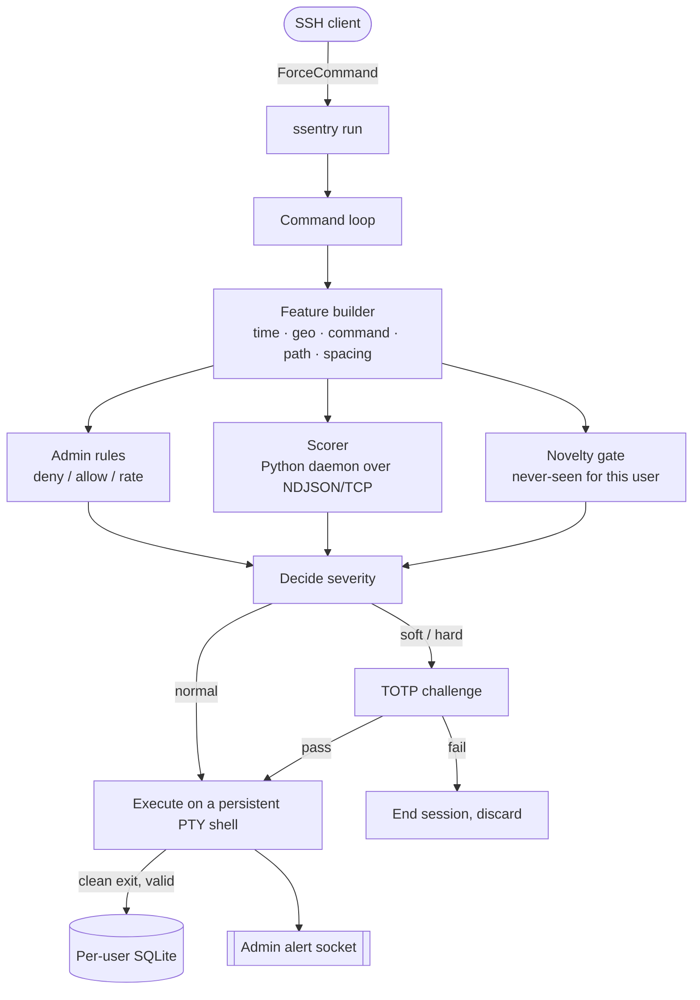
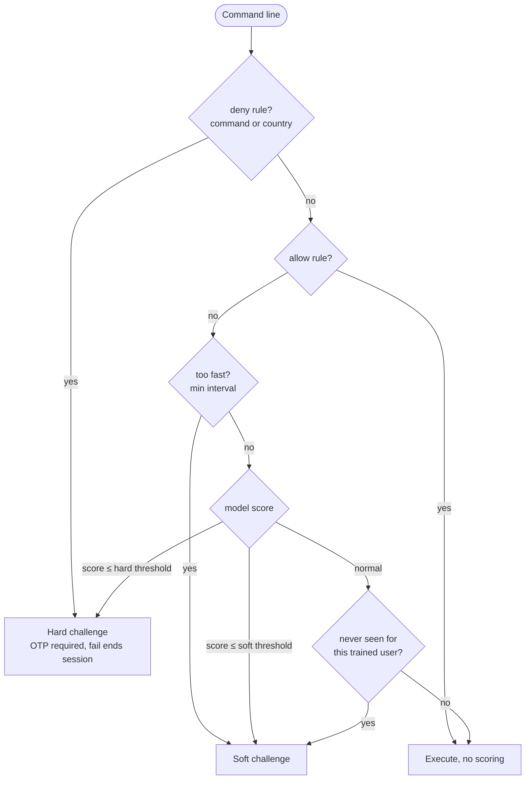
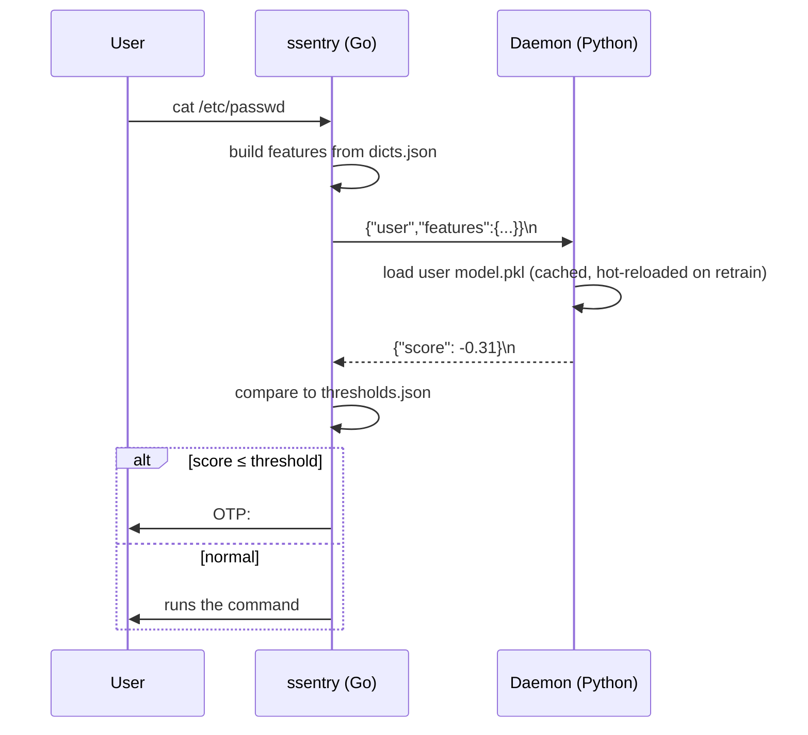
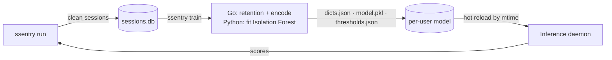

<div align="center">

# Shell Sentry

**Behavioural anomaly detection for SSH sessions.**
Every command a user runs is scored in real time against how *that user* normally
behaves, and anything unusual is challenged with a one time code before it runs.

[](LICENSE)
[](https://go.dev)
[](https://www.python.org)
[](#try-it-in-one-command)
[](#contributing)

</div>

---

## What it is

Shell Sentry (`ssentry`) is a server side wrapper for SSH logins. You wire it in
as the login's forced command, so it becomes the shell. From that moment it sees
every command the user types, turns each one into a small behavioural fingerprint
(what, when, from where, how fast), and asks a per user machine learning model
whether that fingerprint looks normal. A normal command runs immediately. An
unusual one, or one that breaks an admin rule, or one the user has literally never
run before, is gated behind a TOTP challenge. Clean sessions are recorded and
later become the training data for that user's model, so the system keeps learning.

The runtime is written in Go for a fast, dependency light path on every keystroke.
The learning and scoring live in a small Python service using scikit learn. The
two halves talk over a tiny newline delimited JSON protocol on a local socket.

## Try it in one command

The fastest way to understand Shell Sentry is to play with it. This builds a
throwaway container with a clean user and the scoring daemon already running, then
drops you into a shell to drive it yourself:

```bash
make playground        # or:  just playground
```

Inside the container:

```text
ssentry run                    # start a MONITORED session
                               #   first time: a TOTP QR is shown; save it in an
                               #   authenticator app, then answer [y/N] to confirm.
                               #   type commands, then `exit` to end (the session
                               #   is saved). Ctrl-C does NOT drop you out.
ssentry train --user tester    # once you have a few saved sessions, train a model
otp                            # print the current TOTP code to answer a challenge
```

What to watch, from moment zero:

1. First `ssentry run`: no model yet, so every command passes (the learning phase).
2. Run a handful of sessions with everyday commands, `exit` each one, then train with `ssentry trin --user tester`.
3. Run again: now a command you have never used, a login from a new country, or an
   odd hour gets challenged. `mkfs ...` is deny listed and always challenges.

Data persists between runs in a Docker volume, so you can build up history and
retrain. To start over: `make playground-reset`.

## What it does

- **Per command anomaly scoring** with a per user Isolation Forest model.
- **Behavioural features**, frequency encoded: the command, the country, and the
  path are each weighted by how often the user does them. Common looks normal,
  rare looks suspicious.
- **A novelty gate**: a command, country, or path that is genuinely new for an
  already trained user is challenged, judged in the context of that user's own
  history. You never `sudo`, so this `sudo` is flagged.
- **Admin rules** as a first filter: command and country allow and deny lists,
  and a minimum interval between commands. These work even before a model exists.
- **Adaptive challenges**: soft and hard anomalies both require a TOTP code, with
  the QR provisioned on first login and only saved after explicit confirmation.
- **Clean session logging** to a per user SQLite database, used later for training.
- **Real time admin alerts** streamed as newline delimited JSON on a Unix socket.

## How it works

### Runtime architecture



The Go binary owns the session: it reads the command, builds the feature vector,
consults the rules, the model, and the novelty gate, and only then either runs the
command on a persistent pseudo terminal or asks for a code. It is hexagonal:
`core/` is pure logic with zero external dependencies, `ports/` are the interfaces,
and `adapters/` are the concrete implementations (SQLite, the scorer client,
MaxMind GeoIP, the TOTP prompt, the PTY shell, the alert socket).

### Decision flow for a single command



The final severity is the strongest of the model verdict and the novelty gate. A
new item never weakens a harder verdict, but it can raise a "the model says fine"
command to a challenge.

### Scoring a command (Go to Python)



If the daemon does not answer within the configured budget, `ssentry` fails open
(treats the command as normal) and alerts, so a slow or missing model never blocks
the user.

### The learning lifecycle



## Why it works this way

- **Per user, not global.** "Unusual" only means something relative to a person's
  own habits. An admin who runs `sudo` all day and a developer who never does are
  held to different baselines. The context is the user's own vocabulary.
- **Frequency encoding, not identifiers.** A raw id (command number 5) carries no
  meaning for a distance based model. An occurrence count does: common commands
  form a dense normal region, rare and unseen ones fall into the sparse tail the
  Isolation Forest flags.
- **A deterministic novelty gate on top of the model.** An Isolation Forest is
  trained only on normal data, so it cannot reliably flag a single never seen
  command on its own. The runtime knows exactly which items are new (index zero
  against a trained vocabulary), so a small explicit rule covers that case
  precisely, while the model handles behavioural drift.
- **Fail open on the hot path.** Security should not lock a legitimate user out
  because a background service is slow. A scorer timeout is treated as normal and
  alerted, never as a block.
- **Go for the session, Python for the maths.** The keystroke path stays fast and
  self contained; the model lives where scikit learn already does the heavy lifting.

## Full usage

The Go module lives under `./go`, the Python side under `./python`.

```bash
make build        # -> ./ssentry            (or: go -C go build -o ../ssentry ./cmd/ssentry)
make test         # go -C go test ./...
make lint         # go -C go vet ./...
make venv         # create python/venv and install requirements
make py-test      # python unit tests (daemon, model cache, trainer)
```

Configure:

```bash
cp config.example.yaml config.yaml
cp rules.example.json rules.json
```

Optionally place a `GeoLite2-Country.mmdb` from MaxMind at `geoip_db_path`. Without
it the geo feature degrades gracefully to "unknown".

Start the scoring daemon (it reads the same `config.yaml`), then run a session:

```bash
make daemon                                                  # inference service
SSENTRY_CONFIG=config.yaml SSH_CONNECTION="203.0.113.7 22 10.0.0.1 22" ./ssentry run
```

Train a user's model once they have enough recorded sessions:

```bash
./ssentry train --user alice --config config.yaml
```

In production, wire `ssentry run` as the forced command for the account:

```
# ~/.ssh/authorized_keys
command="/usr/local/bin/ssentry run --config /etc/ssentry/config.yaml" ssh-ed25519 AAAA...
```

Now `exit` or Ctrl-D ends the monitored session (saving it) and closes SSH. Ctrl-C
does not drop the user to a raw shell.

## Configuration

All settings live in `config.yaml` (copy of `config.example.yaml`).

| Key | Type | Default | Purpose |
|-----|------|---------|---------|
| `root_path` | string | `./data` | Per user folder root; holds `sessions.db`, `dicts.json`, `thresholds.json`, `model.pkl`, `totp.secret` |
| `geoip_db_path` | string | `./GeoLite2-Country.mmdb` | MaxMind GeoLite2 Country database (optional) |
| `daemon_addr` | string | `127.0.0.1:9099` | Inference daemon address (keep on localhost) |
| `score_timeout_ms` | int | `800` | Scorer reply budget; exceeding it fails open |
| `alert_socket` | string | `./data/alerts.sock` | Admin alert stream (Unix socket, NDJSON) |
| `otp_retries` | int | `3` | OTP attempts before the session is invalidated |
| `rules_path` | string | `./rules.json` | Admin rules file |
| `model_ttl_sec` | int | `900` | Daemon in memory model idle eviction |
| `command_timeout_ms` | int | `0` | Per command ceiling; `0` disables it (recommended for interactive use) |
| `min_sessions_train` | int | `20` | Below this many saved sessions, training is skipped |
| `max_sessions_keep` | int | `500` | Above this, the oldest sessions are pruned before training |
| `python_bin` | string | `""` | Trainer interpreter; empty resolves the venv, then `python3` |
| `trainer_script` | string | `""` | Trainer path; empty resolves `./python/trainer.py` |
| `novelty_severity` | string | `soft` | Never seen item for a trained user: `off`, `soft`, or `hard` |

## The model, features, and novelty

Each command becomes six numbers: `time_cos`, `time_sin` (cyclic time of day, so
23:59 and 00:00 are neighbours), `geo_id`, `cmd_index`, `path_index`, and
`secs_since_last`.

`cmd_index`, `geo_id`, and `path_index` are frequency encoded per user at training
time: a command run 100 times encodes as 100, a country seen twice as 2, something
never seen as 0. Common items sit in the dense region the model learns as normal;
rare and unseen items fall into the sparse tail it flags. The score is high for
normal and low for anomalous, and `ssentry` challenges when the score is at or
below the soft (5th percentile) or hard (2nd percentile) threshold saved at
training time.

Because a model trained only on normal data cannot reliably flag a single unseen
command on its own, a **novelty gate** complements it: for an already trained user,
any command, country, or path whose encoded value is 0 (never seen against a non
empty vocabulary) is raised to `novelty_severity`. A geo lookup that failed is not
treated as a new country, and a command with no path never triggers path novelty.
Untrained users are never novelty gated.

## Rules

`rules.json` (copy of `rules.example.json`) is the admin first filter, effective
even before any model exists:

```json
{
  "commands": { "deny": ["rm -rf /", "mkfs", "dd"], "allow": ["ls", "pwd"] },
  "min_seconds_between": 1,
  "countries": { "deny": ["KP"], "allow": ["IT", "US"] }
}
```

Precedence: deny (hard challenge) beats allow (bypass) beats the minimum interval
(soft challenge) beats the model. Command entries match by whitespace token
prefix, so `mkfs` catches `mkfs /dev/sda`, and the check runs on every segment of
a compound line (`echo hi && mkfs` is still caught). Command substitution,
`eval`, and aliases are not parsed, so deny list untrusted interpreters for depth.

## Security notes

- The daemon loads `model.pkl` with `pickle`, which executes code if an attacker
  can write it. Treat `root_path` as trusted only if the trainer account is its
  sole writer, and keep `daemon_addr` on localhost.
- An unusable or corrupt `model.pkl` is deleted on load and the user reverts to
  untrained, rather than serving a broken model or looping on a bad file.
- TOTP secrets are stored `0600` and only persisted after the user confirms
  enrollment, so a dismissed QR is shown again instead of locking the user out.

## Known limitations

- **Nested shells and multiplexers** (`tmux`, `screen`, `bash`, `ssh`, `docker`)
  spawn their own shells that bypass the wrapper. Deny list them until in kernel
  interception (eBPF, auditd) lands.
- **Shell metacharacters** beyond the top level operators (command substitution,
  `eval`) are not parsed by the rule pre filter. The model still scores the line.

## Project layout

```
shell_sentry/
├── go/                     Go module (shellsentry): the runtime
│   ├── core/                pure logic (features, rules, decisions, encoders)
│   ├── ports/               hexagonal interfaces
│   ├── adapters/            sqlite, scorer client, geoip, totp, pty shell, alerts
│   └── cmd/ssentry/         the binary (cobra: `run` and `train`)
├── python/                 training and inference
│   ├── daemon.py            inference daemon (threaded TCP, NDJSON)
│   ├── model_cache.py       per-user model cache (mtime reload, TTL)
│   └── trainer.py           stateless Isolation Forest trainer
├── docker/                 Linux integration harnesses and the playground
├── config.example.yaml     rules.example.json
└── Makefile · justfile · LICENSE
```

## Roadmap

- [x] Go runtime: features, rules, PTY shell, TOTP, SQLite, alerts
- [x] Python inference daemon (Isolation Forest, NDJSON, hot reload, TTL cache)
- [x] Python trainer with retention and gating (`ssentry train`)
- [x] Frequency encoding and per user novelty gate
- [x] Interactive Docker playground
- [ ] ForceCommand deployment tooling (systemd unit, install script, hardening)
- [ ] Nested shell monitoring (syscall interception)
- [ ] Shell UX: up-arrow history recall, tab completion, `user:path` prompt
- [ ] Performance work (persistent scorer connection, alert batching)

## Contributing

Contributions are welcome, from bug reports to features to docs. The quickest way
to form an opinion is `make playground`; short, concrete suggestions from that
first run are especially valuable.

1. Open an issue to discuss substantial changes first.
2. Keep the hexagonal discipline: `core/` stays dependency free, adapters depend
   on ports and never the reverse.
3. Test first: a failing test, then the smallest code that passes it.
4. Keep commits imperative and scoped (`type: message`, 72 characters or fewer).

## License

Released under the [MIT License](LICENSE). Use it, fork it, ship it.
