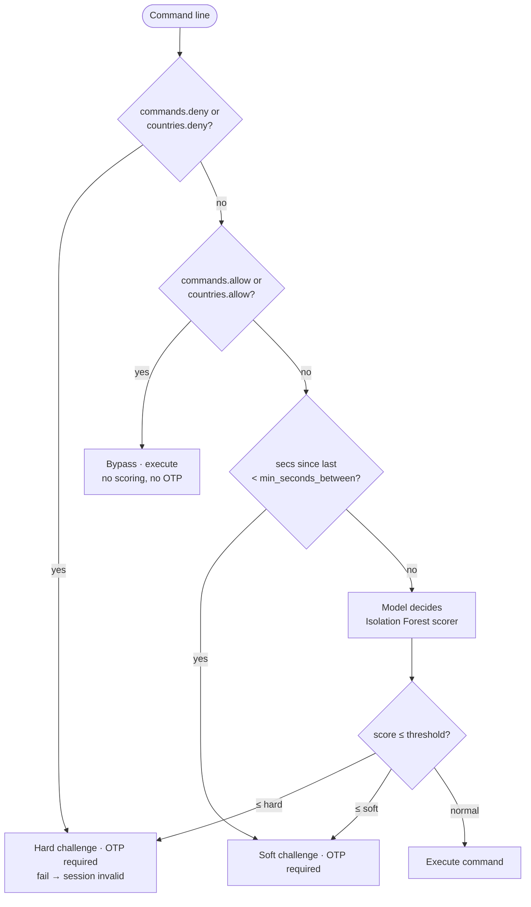

# Shell Sentry (`ssentry`)

[](https://go.dev/)
[](./LICENSE)
[](#contributing)
[](#build)

**A ForceCommand shell wrapper that scores every SSH command for anomalies and gates suspicious activity behind TOTP verification.**

## Overview

Shell Sentry (`ssentry`) is a security-first SSH shell wrapper that runs on the server side to detect and challenge anomalous commands in real time. It combines:

- **Per-command anomaly scoring** via a Python inference daemon (Isolation Forest model)
- **Admin pre-filters** (command deny/allow lists, country deny/allow lists, rate limiting)
- **Adaptive challenges** (TOTP verification for soft/hard anomalies)
- **Persistent session logging** (per-user SQLite, one session per SSH login)
- **GeoIP resolution** (MaxMind GeoLite2; influences anomaly scoring)
- **Admin alerting** (Unix socket, real-time NDJSON alert stream)

## Architecture

Hexagonal: `core/` is pure Go (zero external deps), `ports/` defines contracts, `adapters/` implement them, `cmd/ssentry/` wires everything.


### Rule Precedence (decision flow)



## Quickstart

### Build

```bash
go build -o ssentry ./cmd/ssentry
```

### Configure

Copy and customize the config and rules:

```bash
cp config.example.yaml config.yaml
cp rules.example.json rules.json
mkdir -p data
```

Download `GeoLite2-Country.mmdb` from MaxMind (free account) into the project root, or update `geoip_db_path` in `config.yaml`.

### Start the Python Inference Daemon

The daemon must be running before `ssentry` launches.

Quick mock for testing:

```bash
python3 -c '
import socket,json
s=socket.socket(); s.setsockopt(socket.SOL_SOCKET,socket.SO_REUSEADDR,1)
s.bind(("127.0.0.1",9099)); s.listen()
while True:
    c,_=s.accept()
    f=c.makefile("rw")
    line=f.readline()
    f.write(json.dumps({"score":1.0})+"\n"); f.flush(); c.close()
' &
```

### Run

```bash
SSENTRY_CONFIG=config.yaml SSH_CONNECTION="8.8.8.8 22 127.0.0.1 22" ./ssentry
```

On first login, you'll see a TOTP QR code and secret. Scan it into an authenticator app.

Then:

```
ssentry> whoami
alice
ssentry> cd /tmp
ssentry> pwd
/tmp
ssentry> exit
```

### Verify the Session

Sessions are persisted to per-user SQLite on clean exit:

```bash
sqlite3 data/$USER/sessions.db "SELECT id, command_count FROM session; SELECT raw_cmd FROM command LIMIT 5;"
```

## Configuration

All paths and thresholds are defined in `config.yaml` (copy of `config.example.yaml`).

| Key | Type | Default | Purpose |
|-----|------|---------|---------|
| `root_path` | string | `./data` | Per-user folder root; `<root>/<user>/` holds `sessions.db`, `dicts.json`, `thresholds.json`, `totp.secret` |
| `geoip_db_path` | string | `./GeoLite2-Country.mmdb` | MaxMind GeoLite2 Country database (binary, ~180 KB) |
| `daemon_addr` | string | `127.0.0.1:9099` | Python inference daemon TCP address (NDJSON protocol) |
| `score_timeout_ms` | int | `800` | Max time (ms) to wait for scorer; exceed → fail-open (score=+∞, alert `scorer-timeout`) |
| `alert_socket` | string | `./data/alerts.sock` | Admin alert stream (Unix domain socket, NDJSON) |
| `otp_retries` | int | `3` | Max OTP attempts before session invalidates |
| `rules_path` | string | `./rules.json` | Admin deny/allow rules file (JSON) |
| `model_ttl_sec` | int | `900` | Model age tolerance (used by trainer; ssentry reads but does not enforce) |

## Rules Format

Rules are in `rules.json` (copy of `rules.example.json`). They define hard-coded pre-filters:

```json
{
  "commands": {
    "deny": ["rm -rf /", "mkfs", "dd"],
    "allow": ["ls", "pwd", "whoami"]
  },
  "min_seconds_between": 1,
  "countries": {
    "deny": ["KP"],
    "allow": ["IT", "US"]
  }
}
```

### Precedence

1. **Deny** (hard-challenge): `commands.deny` or `countries.deny` → OTP required, fail invalidates session.
2. **Allow** (bypass all checks): `commands.allow` or `countries.allow` → command executes without scoring or OTP.
3. **Min-seconds-between** (soft-challenge): fewer than N seconds since last command → OTP required.
4. **Default** (model decides): if no rule matches, send to Isolation Forest scorer.

If multiple rules match, the highest precedence wins. (See the decision flow diagram above.)

### Match Semantics

- `commands.deny` and `commands.allow` match the **entire raw command line** (whitespace-separated fields).
- `countries.deny` and `countries.allow` match the ISO country code resolved from the client IP (via MaxMind GeoIP).

## Known Limitations

### Multiplexer & Sub-shell Blind Spot

**Problem:** Commands like `tmux`, `screen`, `bash`, `ssh`, `docker` spawn nested shells or multiplexers. Once inside, all sub-commands bypass `ssentry` entirely — we only see the outer command.

**Mitigation:**

1. **Deny-list** these commands in `rules.json` until nested monitoring is available:
   ```json
   "deny": ["tmux", "screen", "bash", "sh", "zsh", "python", "perl", "ruby", "ssh", "su", "sudo", "docker"]
   ```

2. **Future:** Add a second-stage monitor inside the container or use `fanotify` to intercept fork/exec syscalls (not yet implemented).

## Roadmap

- [x] Core feature engineering (time-of-day cycling, path detection)
- [x] Hexagonal architecture (core, ports, adapters)
- [x] SQLite session persistence (per-user DB)
- [x] NDJSON scorer client (TCP to Python daemon)
- [x] TOTP provisioning + QR codes
- [x] PTY shell wrapper with sentinel markers
- [x] Admin alerting (Unix socket NDJSON stream)
- [x] GeoIP resolution (MaxMind)
- [x] Config & rules templates
- [ ] **Spec 2:** Python inference daemon (Isolation Forest, NDJSON protocol, model reload on trainer completion)
- [ ] **Spec 3:** Python trainer (on new sessions, retrain per-user Isolation Forest, persist dicts + thresholds)
- [ ] **Spec 4:** ForceCommand integration (via `~/.ssh/authorized_keys force-command=/path/to/ssentry`)
- [ ] Nested-shell monitoring (syscall intercept or container boundary monitor)
- [ ] Performance optimization (connection pooling, model caching, alert batching)

## Development

```bash
go test ./...   # run tests
go vet ./...    # lint
go build -o ssentry ./cmd/ssentry   # build
```

## Files & Architecture

```
shell_sentry/
├── core/                       # Pure Go, zero external deps
│   ├── timecycle.go             # Time-of-day cyclic encoding
│   ├── path.go                  # Path argument detection
│   ├── feature.go               # Feature builder & dicts
│   ├── decide.go                # Severity decision logic
│   ├── session.go               # Session model
│   └── rules.go                 # Admin rule engine
├── ports/                      # Hexagonal interfaces
│   └── ports.go                 # Scorer, Store, GeoResolver, Alerter, OTPVerifier, Shell
├── adapters/                   # Technology-specific implementations
│   ├── sqlitestore/             # Per-user SQLite session persistence
│   ├── scorerclient/            # NDJSON/TCP client to Python daemon
│   ├── geomaxmind/              # MaxMind GeoLite2 Country lookup
│   ├── alertsock/               # Unix socket admin alerter
│   ├── totpauth/                # TOTP verification + first-login QR
│   └── ptyshell/                # PTY-backed persistent shell
├── cmd/ssentry/                # Main binary
│   ├── main.go                  # Entry point, wiring
│   ├── config.go                # YAML config loader
│   └── repl.go                  # REPL orchestrator (the main loop)
├── config.example.yaml         # Config template
├── rules.example.json          # Rules template
├── README.md                   # This file
├── Makefile                    # Build targets
├── justfile                    # Just (Rust make) equivalents
└── go.mod / go.sum             # Go module definition
```

## Error Handling

- Every I/O error is wrapped with `%w` for causal chains.
- `panic`, `os.Exit`, and `log.Fatal` are forbidden outside `main()`.
- On scorer timeout, `ssentry` fails open: score is set to `+∞` (normal) and an alert is emitted.
- On bad TOTP (3 retries exhausted), the session is marked invalid and not persisted.

## Contributing

Issues and pull requests are very welcome — bug reports, feature ideas, docs fixes, and improvements all help make the product better.

1. Open an issue to discuss substantial changes first.
2. Follow the hexagonal discipline (`core/` stays dependency-free; adapters import ports, never the reverse).
3. TDD: write the failing test first, then the minimal implementation.
4. Keep commits imperative and scoped (`type: message`, ≤72 chars).

## License

Released under the [MIT License](./LICENSE). Use it, fork it, ship it.
